# Screenshots

Captured 2026-08-31 from the live `s5demo` sandbox and the `slack-ug` workspace. Every one is
real state, not a mockup. Use these as deck slides and as the per-act fallback if the live
system misbehaves.

## Salesforce side

### The deal, and the path-ribbon trap
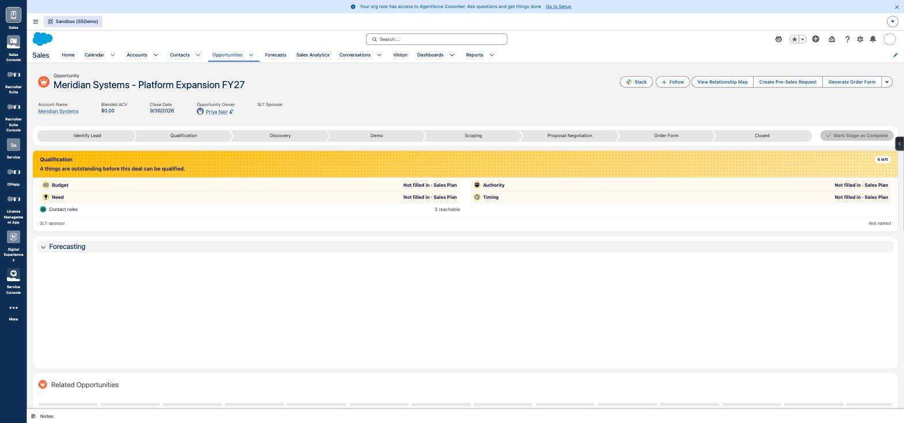

The record the whole demo hangs off — Close Date 9/30/2026, Owner Priya Nair, a **Slack** button
in the header. Note the path ribbon: it reads *Identify Lead · Qualification · Discovery · Demo
· Scoping · Proposal Negotiation · Order Form · Closed* and highlights **Qualification**, while
the record's actual stage is `Proposal/Price Quote` — which is not on the ribbon at all. This is
the trap: point at the Stage field, not the ribbon.

### Agentforce enabled at org level
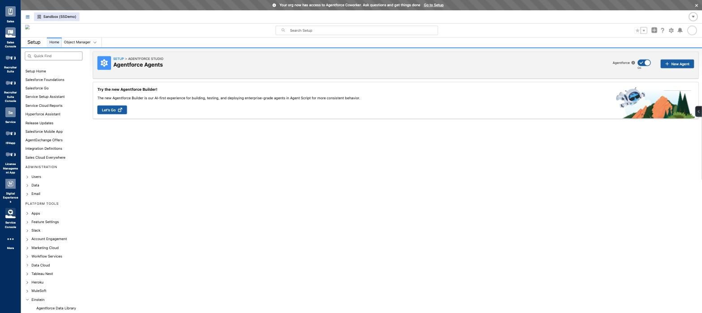

The second of the two enablement toggles, and the one people miss — it lives in the **page
header**, not in the settings list. See
[enable Agentforce in the org](../setup/enable-agentforce-in-the-org.md).

### All three agents, and the lane tell
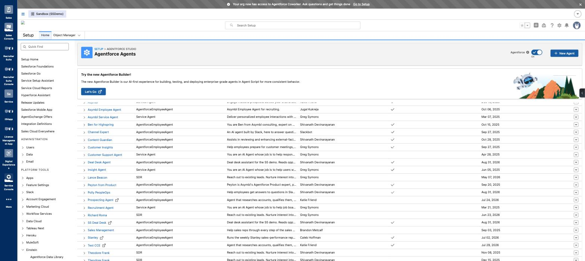

The best single frame for the two-lanes story. **Deal Desk Agent**, **Polly PeopleOps** and
**S5 Deal Desk** are all Active. Look at the `↗` icons: only the Agent Script agents carry them
(they open in the new Agentforce Builder). You can read the authoring lane straight off the
list. See [Agent Script cannot reach Slack](../gotchas/agent-script-cannot-reach-slack.md).

### Polly's identity — inherited, not built here
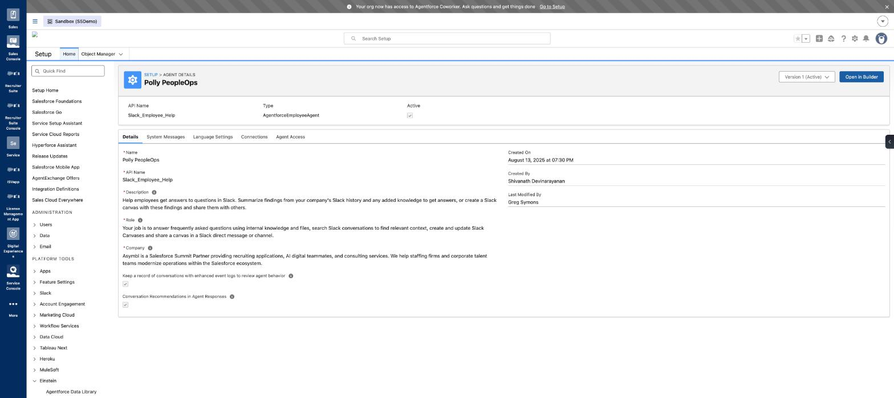

API name `Slack_Employee_Help`, type `AgentforceEmployeeAgent`, Version 1 Active. Created
**August 2025**, `Last Modified By: Greg Symons` — she came from production, which is why her
registration works and a fresh sandbox agent's does not. See
[Polly](../cast/polly-peopleops.md).

### The connection panel that lies
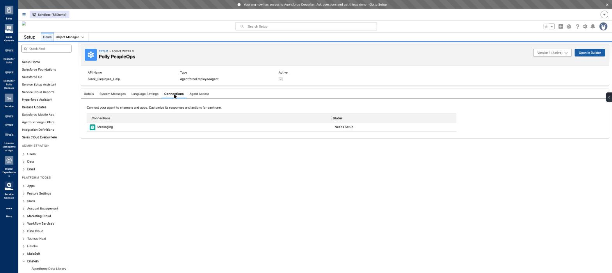

Slack does live under the **Messaging** connection. But this says **Needs Setup** while the
agent was installed and answering in a channel. Do not trust it. See
[both status panels lie](../gotchas/admin-panels-do-not-reflect-runtime-state.md).

### The grafted topic, in Agent Builder
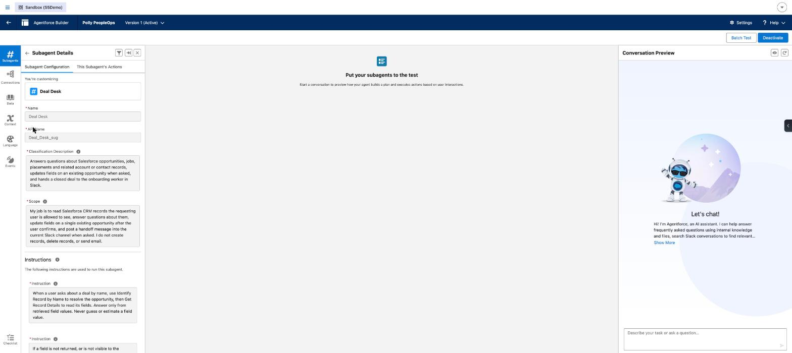

One subagent, `Deal Desk`, API name **`Deal_Desk_sug`** — the `_sug` suffix is the org-wide
uniqueness workaround, visible in the UI. The classification description and the instructions
are ours. This is the proof that the behaviour on stage is not Polly's original agent.

### The seven actions
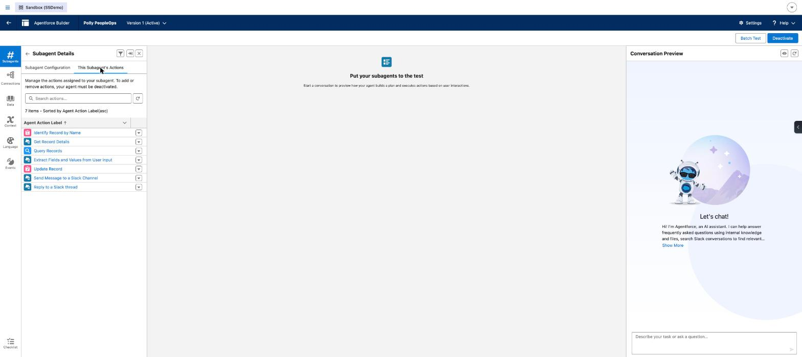

`Identify Record by Name`, `Get Record Details`, `Query Records`, `Extract Fields and Values
from User Input`, `Update Record`, **`Send Message to a Slack Channel`**, **`Reply to a Slack
thread`**. Actions are a hard allow-list — this frame is the reassuring one for a sceptical
room. The two Slack actions are what make the Act 4 handoff possible.

## Slack side

### The channel is the record
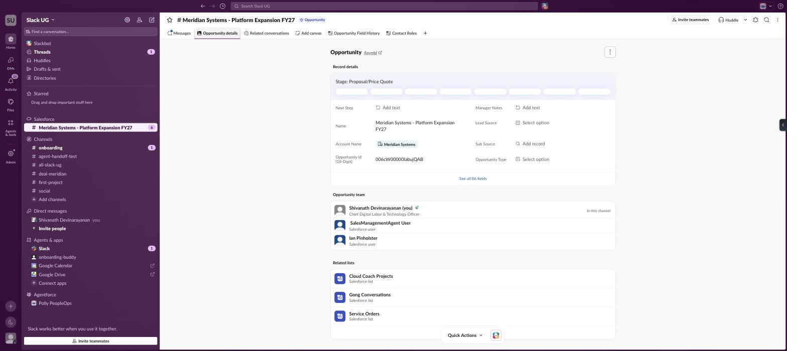

The **Opportunity** badge, the tab strip, and the live record inside Slack — stage, *See all 86
fields*, the Opportunity team, the related lists. Note the sidebar: the channel is grouped under
a **Salesforce** heading and Polly under a separate **Agentforce** heading, apart from ordinary
apps.

### Field History, after a sync
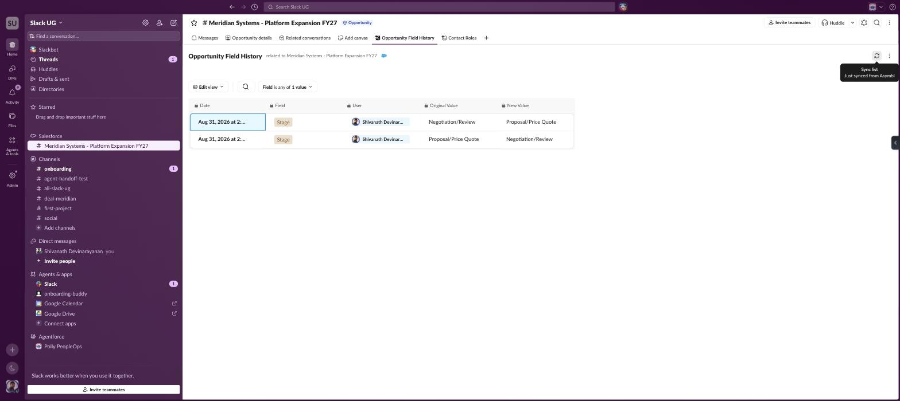

Two rows, filtered to `Field is any of → Stage`, with the *"Sync list · Just synced from
Asymbl"* tooltip visible. **Before the sync this pane was completely empty.** The single most
demo-dangerous behaviour found — see
[record tabs load lazily](../gotchas/record-tabs-load-lazily.md).

### Contact Roles, after a sync
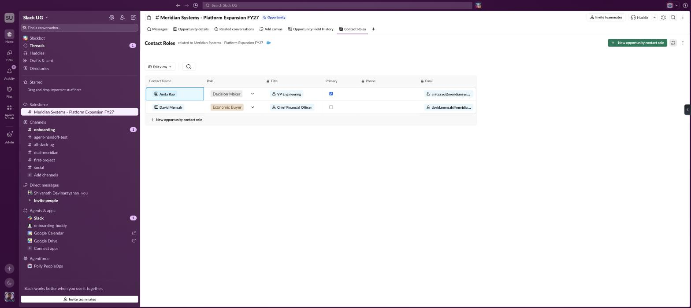

Anita Rao (Decision Maker, VP Engineering, Primary ticked) and David Mensah (Economic Buyer,
CFO), with editable Role dropdowns and a Primary checkbox that write back to Salesforce. Also
empty before the sync.

### The install queue — and what is missing from it
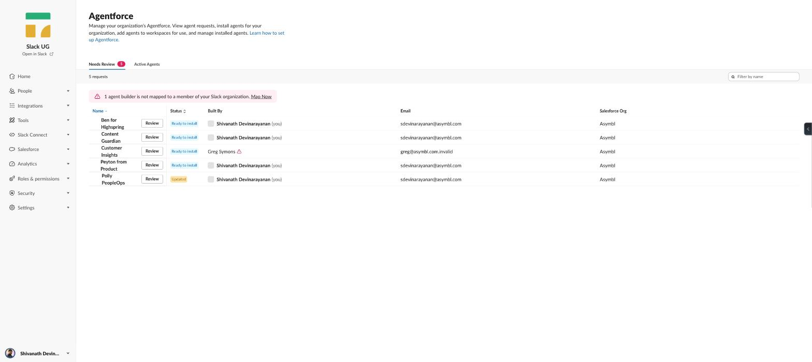

Five agents from Salesforce org **Asymbl** at *Ready to install*. Polly shows **Updated**,
because grafting a topic changed her definition. **`Deal Desk Agent` is not in this list at
all** — that absence is the whole constraint, in one frame.

### And the panel that disagrees with reality
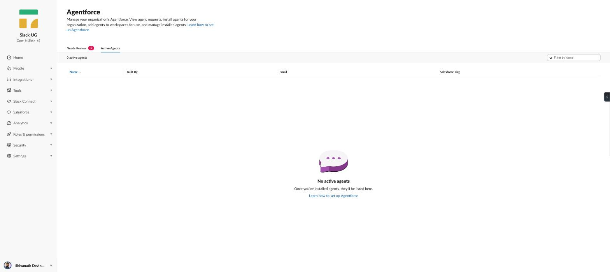

`0 active agents`, taken minutes after Polly answered in a channel. Behaviour is truth; panels
are decoration.

### The handoff, with the bug and the fix in one frame
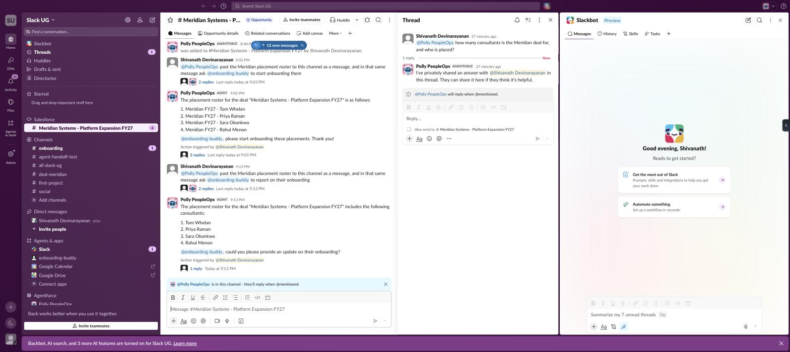

Two handoffs. The first ("start onboarding") shows **2 replies** — the duplicate caused by both
`app_mention` and the `message` listener firing. The second ("report on their onboarding") shows
**1 reply**, after the dedupe was deployed. Also visible: the roster naming all four
consultants, the `@onboarding-buddy` mention, and Slack's *"Action triggered by"* attribution.
See [duplicate bot mentions](../gotchas/duplicate-bot-mentions.md).

### The report card before the consultants were named
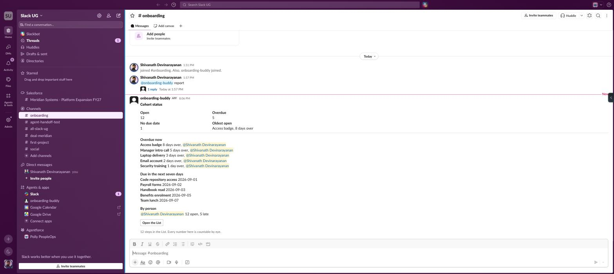

*"Access badge, 8 days over"* — accurate but anonymous. Compare with the current card, which
reads *"Sara Okonkwo — Access badge, 8 days over"*. Useful as a before/after for
[the worker and the List](../setup/the-worker-and-the-list.md).

### Act 3's confirmation is a record card, not a yes/no
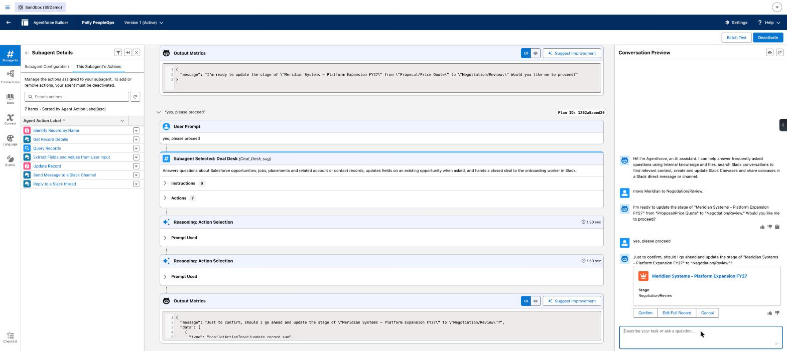

After the natural-language *"Would you like me to proceed?"* and a typed `yes`, the agent renders
the actual record with the pending field change and three buttons. **Edit Full Record** is the one
to point at: the human is not reduced to approving or rejecting, they can amend the proposal before
it commits. Left panel shows the reasoning trace — subagent `Deal_Desk_sug`, 9 instructions, 7
actions, each with timings.

### And the write, with the action that ran
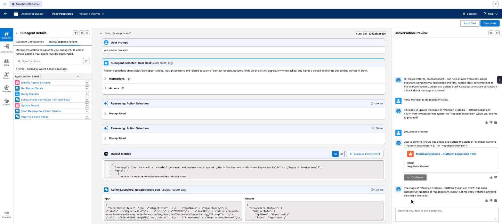

The card flips to **✓ Confirmed**, the agent reports the stage "has been successfully updated", and
the trace shows `update record sug` launched in 1.02 sec — the action that had *not* run on the
previous turn. Salesforce confirms: stage `Negotiation/Review`, Probability auto-moved 75 to 90, a
third row in field history.
